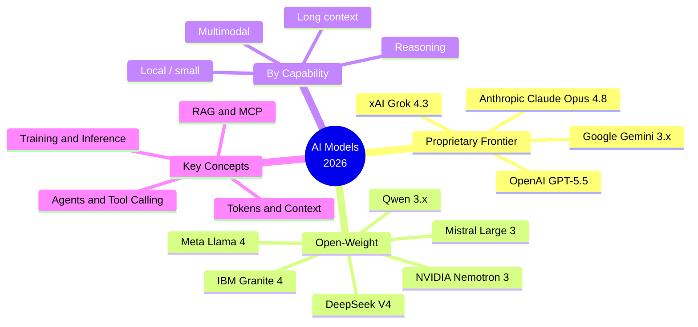

# 🧠 All About AI — Modern AI Models & Essential Terminology

> A clear, visual, presentation-ready guide to today's AI model ecosystem — built for workshops, talks, and self-study.

This repository explains **what modern AI models are, how they differ, and how to choose between them** — without drowning you in math. It is deliberately heavy on **comparison tables, diagrams, timelines, and decision guides**, so the same content works equally well as reference material or as the backbone of a slide deck.

> ⚠️ **The model landscape moves fast.** Everything here is a snapshot as of **June 2026**. Context windows, pricing, licensing, and benchmarks change constantly — always confirm critical details against the [official sources](docs/10-references.md).

---

## 🚀 Start Here

| If you want to… | Go to |
| --- | --- |
| Understand the big picture in 5 minutes | [Introduction](docs/01-introduction.md) |
| Learn the vocabulary (token, context window, RAG, MCP, agents…) | [Terminology Glossary](docs/02-terminology.md) |
| See how the ecosystem is organized | [The Model Landscape](docs/03-model-landscape.md) |
| Compare specific models side by side | [Model Comparisons](docs/04-model-comparisons.md) |
| Read a per-provider breakdown | [Provider Guides](docs/05-provider-guides.md) |
| Pick the right model for a job | [Decision Guides](docs/06-decision-guides.md) |
| See how we got here | [Timeline](docs/07-timeline.md) |
| Understand benchmarks | [Benchmarks Explained](docs/08-benchmarks.md) |
| Go deeper on RAG, agents, fine-tuning, quantization | [Concepts Deep Dive](docs/09-concepts-deep-dive.md) |
| Build a presentation | [Slide Outline](slides/outline.md) |

---

## 📚 Table of Contents

1. **[Introduction](docs/01-introduction.md)** — What is an AI model, and why does the landscape look the way it does?
2. **[Terminology Glossary](docs/02-terminology.md)** — 20 essential terms, each in plain language with an analogy.
3. **[The Model Landscape](docs/03-model-landscape.md)** — Proprietary vs. open-weight, reasoning, multimodal, and the core trade-offs.
4. **[Model Comparisons](docs/04-model-comparisons.md)** — The master comparison tables across every major provider.
5. **[Provider Guides](docs/05-provider-guides.md)** — OpenAI, Anthropic, Google, Meta, Qwen, DeepSeek, Mistral, xAI, NVIDIA, Microsoft, IBM, AI2, Cohere.
6. **[Decision Guides](docs/06-decision-guides.md)** — Best models for coding, reasoning, vision, local, enterprise, long-context, and cost.
7. **[Timeline](docs/07-timeline.md)** — A visual history of how we got to today's frontier.
8. **[Benchmarks Explained](docs/08-benchmarks.md)** — What the scores mean and how to read them critically.
9. **[Concepts Deep Dive](docs/09-concepts-deep-dive.md)** — RAG, MCP, agents, memory, fine-tuning, and quantization.
10. **[References](docs/10-references.md)** — Official documentation and reputable sources.

---

## 🗺️ The Ecosystem at a Glance

---

## 🎯 The 30-Second Summary

- **Two big camps:** *proprietary frontier* models (you call them via API — GPT-5.5, Claude Opus 4.8, Gemini 3.x) and *open-weight* models (you can download and run them — Llama 4, DeepSeek V4, Qwen 3.x).
- **Reasoning is now standard.** Most flagship models can "think" before answering, trading latency and cost for accuracy on hard problems.
- **Multimodal is the default.** Modern flagships natively understand text, images, audio, and increasingly video.
- **Context windows exploded.** 1M-token windows are common; some models reach 2M–10M.
- **The gap is narrowing.** Top open-weight models now land within striking distance of closed frontier models on many tasks — at a fraction of the cost.
- **There is no single "best."** The right model depends on the task, your budget, latency needs, privacy requirements, and where you deploy.

---

## 🤝 Contributing

This is a living document. Corrections, fresher numbers, and new models are very welcome — see [CONTRIBUTING.md](CONTRIBUTING.md).

## 📄 License

Content is released under [CC BY 4.0](LICENSE) — use it freely in your own talks and workshops, with attribution.
