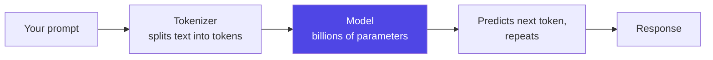
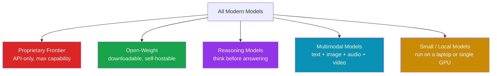

# 1. Introduction

> **In one sentence:** A modern AI model is a very large pattern-recognition engine, trained on enormous amounts of data, that predicts the most useful next piece of an answer — and the differences between models come down to *how* they were built, *what* they can perceive, *how much* they can hold in mind, and *how* you are allowed to use them.

[← Back to README](../README.md) · [Next: Terminology Glossary →](02-terminology.md)

---

## 1.1 What is an AI model?

An **AI model** (specifically, a **large language model** or **LLM**) is a program whose behavior is *learned* rather than *hand-written*. Instead of a developer coding every rule, the model is shown trillions of examples and it adjusts billions of internal numbers (**parameters**) until it becomes very good at predicting what comes next in a sequence.

That single ability — predicting the next **token** — turns out to be enough to write code, summarize documents, answer questions, translate languages, analyze images, and operate tools.

> 💡 **Analogy:** A model is like an extraordinarily well-read assistant who has never *memorized* the books but has absorbed the *patterns* in them. It is fluent and fast, but it can also confidently make things up (**hallucinate**) — see the [glossary](02-terminology.md#hallucination).

---

## 1.2 Why does the landscape look the way it does?

Four forces shape today's market:

| Force | What it means | Why it matters |
| --- | --- | --- |
| **Scale** | Bigger models + more data + more compute = more capability | Created the "frontier" of a handful of extremely capable (and expensive) models |
| **Openness** | Some labs release downloadable weights; others keep them private | Splits the market into *proprietary* and *open-weight* camps |
| **Specialization** | Reasoning, multimodal, coding, and small/local variants | One size no longer fits all — families of models target different jobs |
| **Efficiency** | Mixture-of-Experts, quantization, distillation | Lets smaller/cheaper models punch far above their weight |

---

## 1.3 The five families you need to know

These categories **overlap** — a model can be open-weight, multimodal, *and* a reasoning model at the same time (Qwen 3.x and DeepSeek V4 are good examples). The categories are lenses, not boxes.

The full breakdown lives in **[The Model Landscape](03-model-landscape.md)**.

---

## 1.4 How to use this repository

- **New to AI?** Read this page, then the [Glossary](02-terminology.md). Everything else will make sense afterward.
- **Choosing a model for a project?** Jump to the [Decision Guides](06-decision-guides.md) and the [Comparison Tables](04-model-comparisons.md).
- **Giving a talk?** The [Slide Outline](../slides/outline.md) maps every section to a deck. Diagrams in this repo render directly on GitHub (Mermaid) and copy cleanly into slides.
- **Want sources?** Every factual claim is backed by the [References](10-references.md) page.

> 📌 **A note on accuracy:** Model details change weekly. We use "as of June 2026" framing throughout and round figures where vendors are vague. Treat every number as *approximately right today* and verify before you quote it in production decisions.

---

[← Back to README](../README.md) · [Next: Terminology Glossary →](02-terminology.md)
