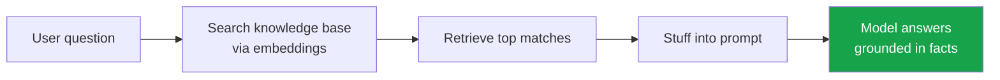
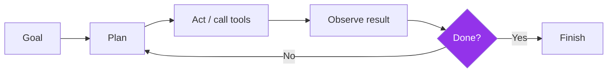

# 2. Terminology Glossary

> The 20 terms you need to follow any conversation about AI models. Each entry has a plain-language definition, an analogy, and why it matters in practice. No math required.

[← Previous: Introduction](01-introduction.md) · [Next: The Model Landscape →](03-model-landscape.md)

---

## Quick reference

| Term | One-line definition |
| --- | --- |
| [Model](#model) | A learned program that predicts the next token |
| [Token](#token) | The chunk of text a model reads and writes |
| [Context Window](#context-window) | How much the model can "see" at once |
| [Parameters](#parameters) | The model's learned internal knobs (its "size") |
| [Foundation Model](#foundation-model) | A large base model adapted to many tasks |
| [Training](#training) | Teaching the model from data (slow, expensive, one-time) |
| [Inference](#inference) | Using the trained model to get an answer (fast, repeated) |
| [Embeddings](#embeddings) | Turning meaning into numbers a computer can compare |
| [RAG](#rag-retrieval-augmented-generation) | Giving the model fresh facts to read before it answers |
| [MCP](#mcp-model-context-protocol) | A universal standard for connecting models to tools and data |
| [Agents](#agents) | Models that plan and act in loops, not just chat |
| [Memory](#memory) | Letting a model recall things across turns or sessions |
| [Reasoning](#reasoning) | The model "thinks" step by step before answering |
| [Tool Calling](#tool-calling) | The model asks to run a function or API |
| [Multimodal](#multimodal) | Understands more than text — images, audio, video |
| [Quantization](#quantization) | Shrinking a model so it runs on cheaper hardware |
| [Fine-tuning](#fine-tuning) | Specializing a base model on your own data |
| [Hallucination](#hallucination) | Confidently stating something false |
| [Temperature](#temperature) | The "creativity vs. consistency" dial |
| [System Prompt](#system-prompt) | The hidden instructions that set the model's behavior |

---

## Model
The trained program itself — billions of numbers that, together, predict the next token. When people say "GPT-5.5" or "Claude Opus 4.8," they mean a specific model: a frozen set of learned weights plus the software that runs them.

> 💡 **Analogy:** A recipe that has been perfected over millions of attempts. You can't see the reasoning written down, but follow it and you get a good dish.

**Why it matters:** Everything else in this glossary describes either how a model is *built*, *fed*, or *used*.

---

## Token
The unit of text a model processes. A token is roughly **¾ of a word** in English — common words are one token, rarer words split into pieces. "unbelievable" might be `un` + `believ` + `able`.

> 💡 **Analogy:** LEGO bricks for language. The model builds every sentence one brick at a time.

**Why it matters:** You are billed **per token** (input + output), context limits are measured **in tokens**, and speed is measured in **tokens per second**. Tokens are the currency of LLMs.

> 📏 Rule of thumb: **1,000 tokens ≈ 750 words ≈ 1.5 pages.**

---

## Context Window
The maximum number of tokens a model can consider **at one time** — your prompt, the conversation history, retrieved documents, *and* its own answer all share this budget.

> 💡 **Analogy:** The model's short-term working memory, or the size of its desk. Anything that doesn't fit on the desk gets pushed off and forgotten.

**Why it matters:** A 1M-token window can hold an entire codebase or a stack of contracts. In 2026, **1M tokens is common**, and some models reach **2M (Gemini 3.1 Pro)** or even **10M (Llama 4 Scout)**. But bigger isn't free — long contexts cost more and models can still "lose the middle" of very long inputs.

---

## Parameters
The learned internal values (weights) adjusted during training. Reported in **billions (B)** — e.g., a "70B model." More parameters generally means more capability but also more cost and slower inference.

> 💡 **Analogy:** The knobs on an impossibly complex mixing board. Training is the long process of finding the right setting for every knob.

**Why it matters:** Parameter count is the rough "size" of a model. Note the modern twist: **Mixture-of-Experts (MoE)** models (Llama 4, DeepSeek V4, Mistral Large 3) have huge *total* parameters but only activate a small slice per token — e.g., Llama 4 Maverick is *400B total but 17B active*. This gives big-model quality at small-model speed. See [active vs. total parameters](09-concepts-deep-dive.md#mixture-of-experts-moe).

---

## Foundation Model
A large, general-purpose model trained on broad data, designed to be **adapted** to many downstream tasks (chat, coding, search) rather than built for one job.

> 💡 **Analogy:** A liberal-arts graduate — broadly knowledgeable, then specialized on the job.

**Why it matters:** Almost every model you'll hear about (GPT, Claude, Gemini, Llama) is a foundation model. Specialized models are usually foundation models that were fine-tuned.

---

## Training
The one-time (per version) process of teaching a model by showing it data and adjusting parameters. It is **slow, expensive, and done by the model maker** — often costing millions of dollars and weeks of compute.

> 💡 **Analogy:** Years of schooling. Intense and costly, but you only do it once.

**Why it matters:** Because training is frozen at a point in time, models have a **knowledge cutoff** and don't know recent events — which is exactly why [RAG](#rag-retrieval-augmented-generation) and [tool calling](#tool-calling) exist.

---

## Inference
Running the trained model to produce an answer. This is what happens **every time you send a prompt** — fast (seconds) and comparatively cheap, but you pay for it on every call.

> 💡 **Analogy:** The graduate actually doing the job. Training was school; inference is work.

**Why it matters:** Inference cost × volume is your real bill. Optimizing inference (via [quantization](#quantization), smaller models, or caching) is where most cost savings live.

---

## Embeddings
A way of turning text (or images, audio…) into a list of numbers (a **vector**) that captures *meaning*, so that similar things end up close together numerically.

> 💡 **Analogy:** A GPS coordinate for meaning. "Dog" and "puppy" land near each other; "dog" and "spreadsheet" are far apart.

**Why it matters:** Embeddings power **semantic search** and are the engine behind [RAG](#rag-retrieval-augmented-generation), recommendation, clustering, and deduplication.

---

## RAG (Retrieval-Augmented Generation)
A technique that **retrieves relevant documents and inserts them into the prompt** so the model answers from *your* up-to-date facts instead of only its frozen training data.

> 💡 **Analogy:** An open-book exam. The model is smart, but you hand it the right pages first.

**Why it matters:** RAG is the most common way to reduce [hallucination](#hallucination), add private/current knowledge, and cite sources — without retraining. Deep dive: [Concepts](09-concepts-deep-dive.md#rag-retrieval-augmented-generation).

---

## MCP (Model Context Protocol)
An open standard (introduced by Anthropic in late 2024, now broadly adopted) that defines **a universal way to connect models to external tools, data sources, and systems** — like a USB-C port for AI.

> 💡 **Analogy:** USB-C for AI. Before, every tool needed a custom adapter; MCP is the one plug that fits everything.

**Why it matters:** MCP lets any compatible model use any compatible tool (files, databases, APIs, browsers) without bespoke integration. It's foundational to the [agent](#agents) ecosystem. Deep dive: [Concepts](09-concepts-deep-dive.md#mcp-model-context-protocol).

---

## Agents
Systems where a model **plans, takes actions, observes results, and repeats** in a loop to accomplish a goal — rather than producing a single reply. Agents use [tool calling](#tool-calling) and [memory](#memory) to get real work done.

> 💡 **Analogy:** The difference between asking a colleague a question (chat) and giving them a project (agent).

**Why it matters:** Agents are the 2026 frontier — coding assistants, research assistants, and "computer use" all rely on agentic loops. Reliability over long horizons is the key challenge.

---

## Memory
Mechanisms that let a model **retain information beyond the current context window** — within a conversation, or persistently across sessions (e.g., remembering your preferences).

> 💡 **Analogy:** A notebook the assistant keeps between meetings, since its desk (context) gets wiped each time.

**Why it matters:** Memory makes assistants feel personal and lets agents work on long tasks. It's usually built *around* the model (via storage + retrieval), not baked into the weights.

---

## Reasoning
A mode where the model **generates intermediate "thinking" steps before its final answer**, dramatically improving accuracy on math, logic, coding, and multi-step problems. Often called *chain-of-thought*, *thinking*, or *test-time compute*.

> 💡 **Analogy:** Showing your work on a math test instead of blurting the answer.

**Why it matters:** Reasoning models (o-series, Claude with extended thinking, Gemini Deep Think, DeepSeek V4, Qwen "thinking" modes) are far stronger on hard tasks — but slower and pricier because they generate many extra "thinking" tokens. Many 2026 flagships let you **dial reasoning effort** up or down.

---

## Tool Calling
The model's ability to **request that a function, API, or tool be run** (e.g., "search the web," "run this code," "query the database") and then use the result. Also called *function calling*.

> 💡 **Analogy:** A smart assistant who knows when to pick up the phone and call a specialist instead of guessing.

**Why it matters:** Tool calling is how models overcome their limits — getting live data, doing exact math, taking real actions. It is the building block of [agents](#agents) and is standardized by [MCP](#mcp-model-context-protocol).

---

## Multimodal
A model that can understand and/or generate **more than one type of data** — text plus images, audio, video, or documents — natively, in a single model.

> 💡 **Analogy:** A person who can read, see, and listen, rather than only read.

**Why it matters:** Multimodal is the default for 2026 flagships. It enables screenshot debugging, document understanding, chart reading, voice interfaces, and "computer use" agents. *Native* multimodality (trained on all types together) usually beats bolting on separate models.

---

## Quantization
Compressing a model by storing its parameters with **lower numerical precision** (e.g., 16-bit → 8-bit or 4-bit), making it smaller and faster with usually minor quality loss.

> 💡 **Analogy:** Saving a photo as a slightly compressed JPEG — much smaller file, hard to tell the difference.

**Why it matters:** Quantization is what lets a "70B" model run on a single consumer GPU or even a laptop. It is essential for **local deployment** and cutting inference costs. Deep dive: [Concepts](09-concepts-deep-dive.md#quantization).

---

## Fine-tuning
Taking a pre-trained base model and **training it further on a smaller, specialized dataset** to adapt its style, domain knowledge, or behavior.

> 💡 **Analogy:** A general doctor doing a residency to become a cardiologist.

**Why it matters:** Fine-tuning specializes a model for your domain, tone, or format. Modern efficient methods (**LoRA/PEFT**) make it cheap. Note: for adding *facts*, [RAG](#rag-retrieval-augmented-generation) is usually better and cheaper than fine-tuning. Deep dive: [Concepts](09-concepts-deep-dive.md#fine-tuning).

---

## Hallucination
When a model produces **confident, fluent, but false or fabricated** information — invented citations, wrong facts, non-existent functions.

> 💡 **Analogy:** A student who never says "I don't know" and instead makes up a plausible-sounding answer.

**Why it matters:** Hallucination is the #1 reliability risk. Mitigations: [RAG](#rag-retrieval-augmented-generation) (ground in real sources), [tool calling](#tool-calling) (verify with real systems), lower [temperature](#temperature), reasoning models, and human review for high-stakes uses.

---

## Temperature
A setting (typically 0–2) that controls **randomness** in the model's output. Low temperature = focused, deterministic, repetitive. High temperature = creative, varied, riskier.

> 💡 **Analogy:** A dial from "strict accountant" (0) to "brainstorming poet" (high).

**Why it matters:** Use **low** temperature for code, extraction, and factual tasks; **higher** for creative writing and ideation. Note: many 2026 reasoning models manage this internally and expose a `reasoning effort` control instead.

---

## System Prompt
The **initial, behind-the-scenes instructions** that define a model's role, rules, tone, and constraints for a conversation — set by the developer, not the end user.

> 💡 **Analogy:** A job description handed to an actor before the scene: "You are a helpful, concise support agent who never shares internal pricing."

**Why it matters:** The system prompt is the cheapest, fastest way to steer behavior — no training required. It's the foundation of *prompt engineering* and shapes everything the model does in a session.

---

[← Previous: Introduction](01-introduction.md) · [Next: The Model Landscape →](03-model-landscape.md)
