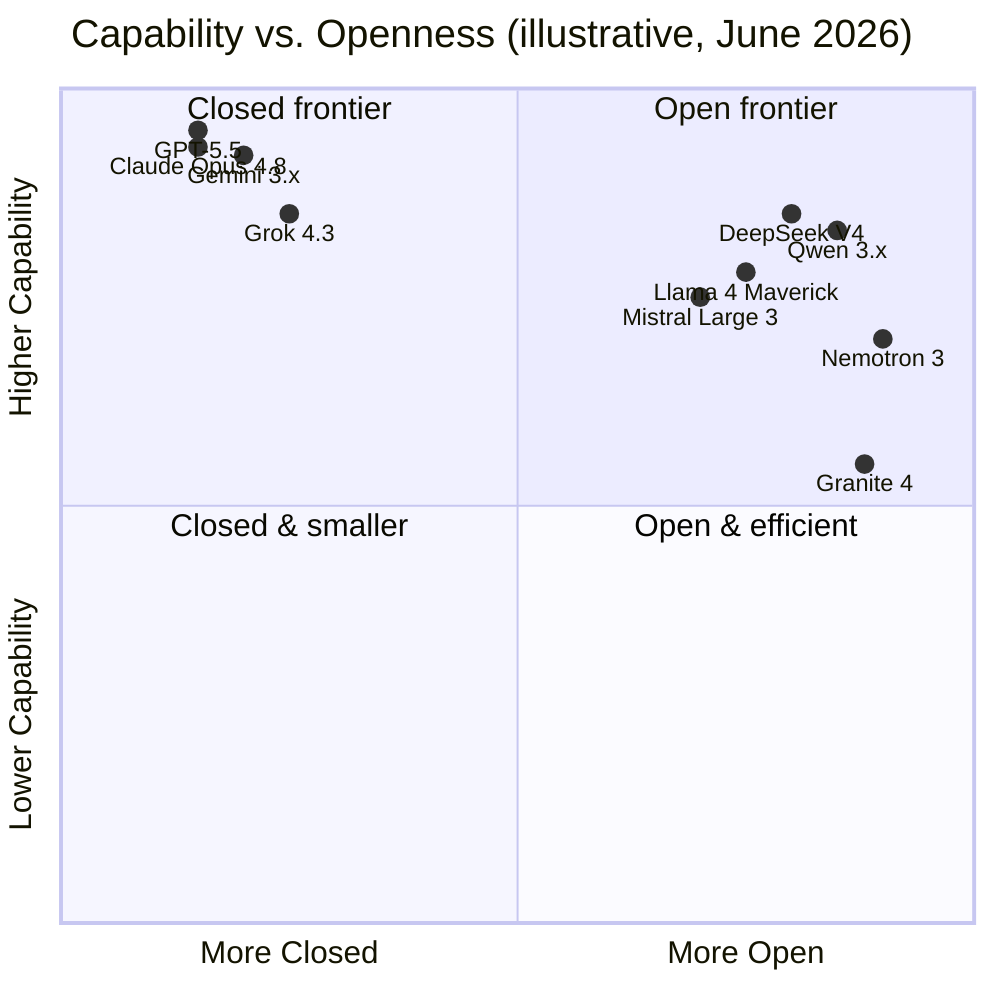
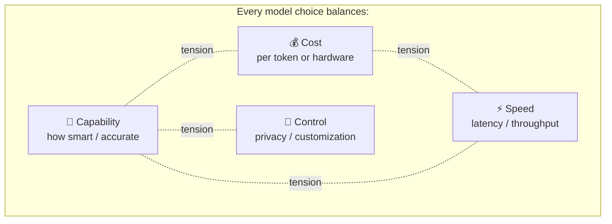

# 3. The Model Landscape

> How the 2026 ecosystem is organized — the camps, the categories, and the trade-offs that actually drive decisions.

[← Previous: Terminology](02-terminology.md) · [Next: Model Comparisons →](04-model-comparisons.md)

---

## 3.1 The two big camps: Proprietary vs. Open-Weight

This is the single most important split in the ecosystem.

| | 🔒 Proprietary (Closed) | 🔓 Open-Weight |
| --- | --- | --- |
| **How you access it** | API call to the vendor's servers | Download the weights; run anywhere |
| **Examples** | GPT-5.5, Claude Opus 4.8, Gemini 3.x, Grok 4.3 | Llama 4, DeepSeek V4, Qwen 3.x, Mistral Large 3, Nemotron 3, Granite 4 |
| **Peak capability** | Generally holds the frontier | Closing fast; tops some open benchmarks |
| **Cost model** | Pay per token | Pay for hardware/hosting (or free locally) |
| **Data privacy** | Data leaves your environment* | Can run fully on-prem / air-gapped |
| **Customization** | Limited (prompts, some fine-tuning) | Full — fine-tune, quantize, modify |
| **Control & lock-in** | Vendor controls updates & availability | You control the version forever |
| **Setup effort** | Minimal — just an API key | Higher — infra, GPUs, ops |

\* Enterprise tiers (zero-retention, private cloud, on-vendor VPC) mitigate this.

> 📌 **"Open-weight" ≠ "open-source."** Most "open" models release the *weights* under a license, but **not** the training data or full training code. Truly open efforts (weights + data + recipe) are rarer — **AI2's OLMo** and **NVIDIA's Nemotron** are the notable champions. Always read the license: Llama uses a custom community license (with restrictions), Qwen/DeepSeek/Mistral often use **Apache 2.0 or MIT** (very permissive), and Cohere's Command A is **non-commercial (CC-BY-NC)**.

---

## 3.2 Categories by capability

The same model often belongs to several of these at once. Think of them as **lenses**.

### 🧩 Reasoning models
Models that generate explicit "thinking" before answering, excelling at math, logic, science, and multi-step coding.
- **Examples:** OpenAI o-series & GPT-5.5 (high reasoning effort), Claude with extended thinking, Gemini Deep Think, DeepSeek V4, Qwen "thinking" mode.
- **Trade-off:** Much better on hard problems; slower and more expensive (extra thinking tokens). Many 2026 models let you **dial reasoning up or down**.

### 👁️ Multimodal models
Natively understand text + images (+ audio, video, documents).
- **Examples:** GPT-5.5, Gemini 3.x (strongest video/audio), Claude (vision), Llama 4 (native multimodal MoE), Qwen-VL, NVIDIA Nemotron Nano Omni, Phi-4-multimodal.
- **Trade-off:** Hugely expands use cases (screenshots, charts, voice); native beats bolted-on.

### 📜 Long-context models
Hold very large inputs at once.
- **Leaders:** Llama 4 Scout (**10M**), Gemini 3.1 Pro (**2M**), Grok 4.20 (**2M**); 1M is now standard (GPT-5.5, Claude, DeepSeek V4, Qwen 3.x).
- **Trade-off:** Enables whole-codebase / whole-corpus tasks, but long contexts cost more and recall can dip in the "middle."

### 💻 Coding-specialized models
Tuned for software engineering and agentic coding.
- **Examples:** Claude (long the coding favorite), GPT-5.5, DeepSeek V4, Qwen 3.x Coder, plus IDE/agent tooling.
- **Trade-off:** Top scores on SWE-bench / Terminal-Bench; pick based on your stack and agent harness.

### 💻 Small / local models
Run on a laptop, phone, or single GPU.
- **Examples:** Microsoft Phi-4 family, Llama 4 Scout (single H100), Qwen3-30B-A3B, NVIDIA Nemotron Nano (30B/3.5B active), IBM Granite 4 (3B/8B), Gemma.
- **Trade-off:** Private, cheap, offline; lower ceiling than frontier models. [Quantization](02-terminology.md#quantization) makes them practical.

---

## 3.3 The core trade-offs (the "you can't have it all" triangle)

| Want this | You usually trade away |
| --- | --- |
| **Maximum capability** | Cost and speed (frontier reasoning is slow & pricey) |
| **Lowest cost** | Some capability (smaller/open models, quantization) |
| **Lowest latency** | Some capability (smaller models, less/no reasoning) |
| **Full privacy & control** | Convenience and (often) peak capability (self-host open weights) |
| **Huge context** | Cost per request and some mid-context recall |

> 🎯 **The practical takeaway:** Don't ask "what's the best model?" Ask "**what's the best model *for this task, at this budget, with these constraints*?**" That's exactly what the [Decision Guides](06-decision-guides.md) answer.

---

## 3.4 Architecture trends shaping 2026

| Trend | What it is | Why it matters |
| --- | --- | --- |
| **Mixture-of-Experts (MoE)** | Only a fraction of parameters fire per token | Big-model quality at small-model cost/speed (Llama 4, DeepSeek V4, Mistral, Nemotron, Qwen) |
| **Adaptive / dial-able reasoning** | Choose how hard the model "thinks" | Pay for deep reasoning only when needed |
| **Native multimodality** | Trained on all data types together | Better cross-modal understanding than bolt-ons |
| **Hybrid architectures** | Mamba/SSM + Transformer blends | Faster, cheaper long-context (NVIDIA Nemotron) |
| **Agentic tuning** | Trained specifically for tool use & long-horizon tasks | The shift from chatbots to autonomous workers |

---

[← Previous: Terminology](02-terminology.md) · [Next: Model Comparisons →](04-model-comparisons.md)
