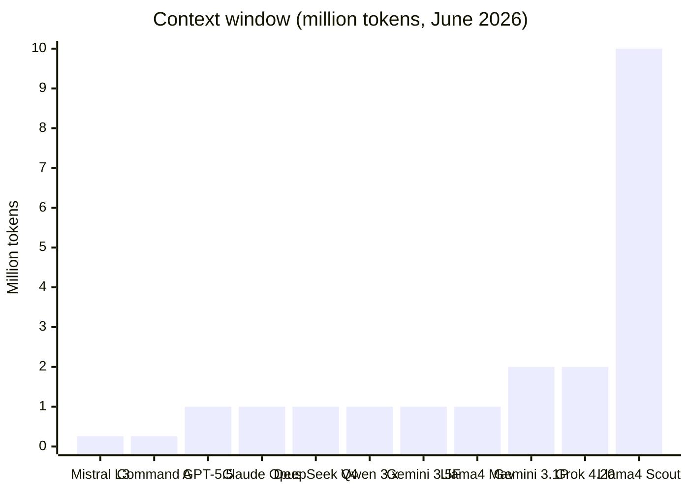
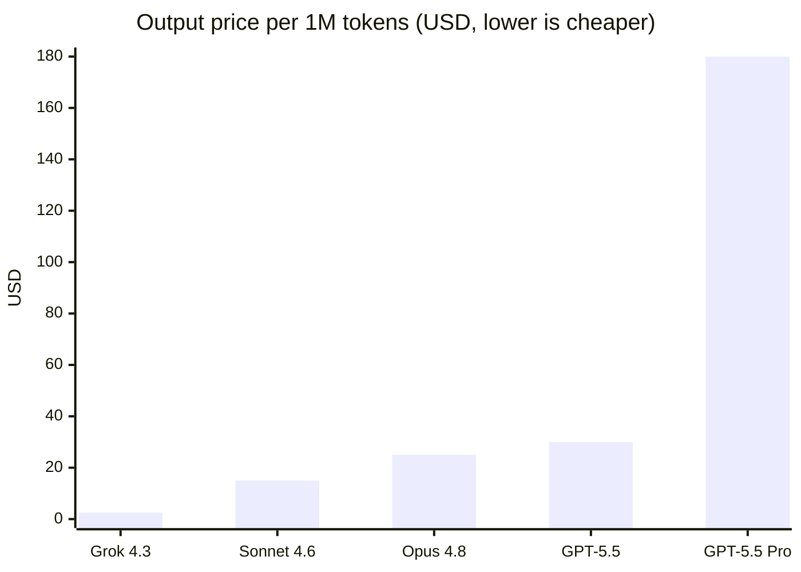

# 4. Model Comparisons

> The master tables. Everything in one place, side by side. **Snapshot: June 2026.**

[← Previous: The Model Landscape](03-model-landscape.md) · [Next: Provider Guides →](05-provider-guides.md)

> ⚠️ **Read this first.** Specs below are approximate and change constantly. Pricing is per **1M tokens** (USD), input/output, standard tier. Benchmarks are directional, not gospel — see [Benchmarks Explained](08-benchmarks.md). Always confirm against [official sources](10-references.md) before making decisions.

---

## 4.1 Flagship frontier models (proprietary)

| Model | Provider | Type | Context | Multimodal | Price (in/out) | Best at |
| --- | --- | --- | --- | --- | --- | --- |
| **GPT-5.5** | OpenAI | Reasoning + chat | ~1M | Text, image | $5 / $30 | All-round, coding agents, math |
| **GPT-5.5 Pro** | OpenAI | Max reasoning | ~1M | Text, image | $30 / $180 | Highest-stakes reasoning |
| **Claude Opus 4.8** | Anthropic | Reasoning + chat | 1M | Text, image | $5 / $25 | Coding, agents, writing |
| **Claude Sonnet 4.6** | Anthropic | Balanced | 1M | Text, image | $3 / $15 | Cost-effective frontier work |
| **Gemini 3.1 Pro** | Google | Reasoning + chat | **2M** | Text, image, audio, video | varies | Long-context, multimodal, video |
| **Gemini 3.5 Flash** | Google | Fast + agentic | 1M | Text, image, audio, video | low | Speed + cost, agentic coding |
| **Grok 4.3** | xAI | Reasoning + chat | 1M | Text, image | $1.25 / $2.50 | Real-time (X data), value |

> 💡 Anthropic also offers a top **Fable 5** tier above Opus (availability has been limited/region-restricted). OpenAI's lineup also includes **GPT-5.4** + **mini/nano**, **GPT-4.1** (1M context), and standalone **o3 / o4-mini** reasoning models.

---

## 4.2 Flagship open-weight models

| Model | Provider | Architecture | Active / Total | Context | License | Best at |
| --- | --- | --- | --- | --- | --- | --- |
| **DeepSeek V4 Pro** | DeepSeek | MoE | — | ~1M (384K out) | **MIT** | Coding & math on a budget |
| **DeepSeek V4 Flash** | DeepSeek | MoE | — | ~1M | **MIT** | Fast, cheap reasoning |
| **Qwen 3.7 Max** | Alibaba | MoE | — | ~1M | (hosted) | Agentic coding, tool use |
| **Qwen3-235B-A22B** | Alibaba | MoE | 22B / 235B | ~1M | **Apache 2.0** | Open frontier, self-host |
| **Llama 4 Maverick** | Meta | MoE (128 exp) | 17B / 400B | 1M | Llama Community | Multimodal, general use |
| **Llama 4 Scout** | Meta | MoE (16 exp) | 17B / 109B | **10M** | Llama Community | Ultra-long context, single H100 |
| **Mistral Large 3** | Mistral | MoE | 41B / 675B | 256K | (open weights) | Multilingual, European option |
| **Nemotron 3 Super** | NVIDIA | Hybrid MoE | 12B / 120B | long | Open (NVIDIA) | Efficient agents, throughput |
| **Command A** | Cohere | Dense | 111B | 256K | CC-BY-NC* | Enterprise RAG (non-commercial) |

\* Command A is downloadable but **non-commercial**; commercial use requires a Cohere license.

---

## 4.3 Small & local models (laptop / single GPU)

| Model | Provider | Size | Context | License | Notes |
| --- | --- | --- | --- | --- | --- |
| **Phi-4-mini** | Microsoft | ~3.8B | 128K | MIT | Strong reasoning for size, function calling |
| **Phi-4-multimodal** | Microsoft | ~5.6B | 128K | MIT | Text + image + audio in one small model |
| **Phi-4-reasoning-vision-15B** | Microsoft | 15B | long | MIT | Multimodal reasoning, GUI grounding |
| **Qwen3-30B-A3B** | Alibaba | 3B active / 30B | ~1M | Apache 2.0 | MoE; fast, capable, runnable locally |
| **Nemotron 3 Nano** | NVIDIA | 3.5B active / 30B | long | Open | Hybrid Mamba-Transformer MoE |
| **Granite 4 (3B/8B)** | IBM | 3B–8B | long | Apache 2.0 | Enterprise-friendly, FP8 variants |
| **Llama 4 Scout** | Meta | 17B active | 10M | Llama Community | Fits a single H100; huge context |
| **OLMo 2 (7B/13B)** | AI2 | 7B–13B | — | Apache 2.0 | **Fully open** (weights + data + recipe) |
| **Gemma** | Google | 1B–27B class | long | Gemma terms | Lightweight Gemini-family open models |

> 🔧 With [quantization](02-terminology.md#quantization), many of these run on consumer GPUs or even high-end laptops via tools like Ollama, LM Studio, or llama.cpp.

---

## 4.4 Capability heatmap (directional)

Relative strength by use case. ●●● = excellent · ●● = strong · ● = capable. *Illustrative, not a benchmark.*

| Model | Coding | Reasoning | Vision | Long-ctx | Speed | Cost-eff. | Local |
| --- | :---: | :---: | :---: | :---: | :---: | :---: | :---: |
| GPT-5.5 | ●●● | ●●● | ●● | ●● | ●● | ● | ✗ |
| Claude Opus 4.8 | ●●● | ●●● | ●● | ●●● | ●● | ● | ✗ |
| Claude Sonnet 4.6 | ●●● | ●● | ●● | ●●● | ●●● | ●● | ✗ |
| Gemini 3.1 Pro | ●● | ●●● | ●●● | ●●● | ●● | ●● | ✗ |
| Gemini 3.5 Flash | ●●● | ●● | ●●● | ●● | ●●● | ●●● | ✗ |
| Grok 4.3 | ●● | ●● | ●● | ●● | ●● | ●●● | ✗ |
| DeepSeek V4 Pro | ●●● | ●●● | ● | ●● | ●● | ●●● | ●● |
| Qwen 3.x | ●●● | ●● | ●● | ●● | ●● | ●●● | ●● |
| Llama 4 Maverick | ●● | ●● | ●● | ●● | ●● | ●● | ●● |
| Llama 4 Scout | ●● | ●● | ●● | ●●● | ●● | ●● | ●●● |
| Mistral Large 3 | ●● | ●● | ●● | ●● | ●● | ●● | ●● |
| Phi-4 family | ●● | ●● | ● | ● | ●●● | ●●● | ●●● |
| Granite 4 | ● | ● | ● | ●● | ●●● | ●●● | ●●● |

---

## 4.5 Context window comparison

| Window size | What it can hold | Models |
| --- | --- | --- |
| **128K–256K** | A long book / large report | Phi-4, Granite 4, Mistral Large 3, Command A |
| **1M** | An entire codebase / hundreds of pages | GPT-5.5, Claude, DeepSeek V4, Qwen 3.x, Gemini Flash, Llama 4 Maverick, Grok 4.3 |
| **2M** | Multiple codebases / a document archive | Gemini 3.1 Pro, Grok 4.20 |
| **10M** | A massive multi-repo corpus | Llama 4 Scout |

> ⚠️ A big window is a *ceiling*, not a guarantee. Models can still lose detail in the middle of very long inputs ("lost in the middle"), and you pay for every token. Long-context pricing often jumps past a threshold (e.g., GPT-5.5 charges more beyond ~272K tokens).

---

## 4.6 Pricing snapshot (per 1M tokens, USD)

| Tier | Examples | Rough output cost | When to use |
| --- | --- | --- | --- |
| 💸 Ultra-cheap | Open-weight self-hosted, DeepSeek V4, Grok 4.3, nano/mini | < $5 | High volume, cost-sensitive, local |
| 💵 Mid | Claude Sonnet 4.6, Gemini Flash, GPT-5.4 | $5–$20 | Balanced production workloads |
| 💰 Premium | Claude Opus 4.8, GPT-5.5, Gemini 3.1 Pro | $20–$40 | Hard tasks, quality-critical |
| 🏦 Top-end | GPT-5.5 Pro, Fable-class | $50–$180 | Highest-stakes reasoning only |

> 💡 **Cost levers that matter more than list price:** prompt caching (up to ~90% off repeated context), batch APIs (~50% off), choosing a smaller model for easy turns, and dialing reasoning effort down.

---

## 4.7 How to read these tables

1. **Start with constraints, not capability.** Privacy → open-weight/local. Tight budget → cheap/open. Must-be-best → frontier.
2. **Match the model to the task**, then size down until quality breaks. The cheapest model that passes your evals wins.
3. **Numbers age fast.** Re-verify context, price, and benchmarks before committing.

➡️ Continue to the **[Decision Guides](06-decision-guides.md)** for "best model for X" recommendations.

---

[← Previous: The Model Landscape](03-model-landscape.md) · [Next: Provider Guides →](05-provider-guides.md)
