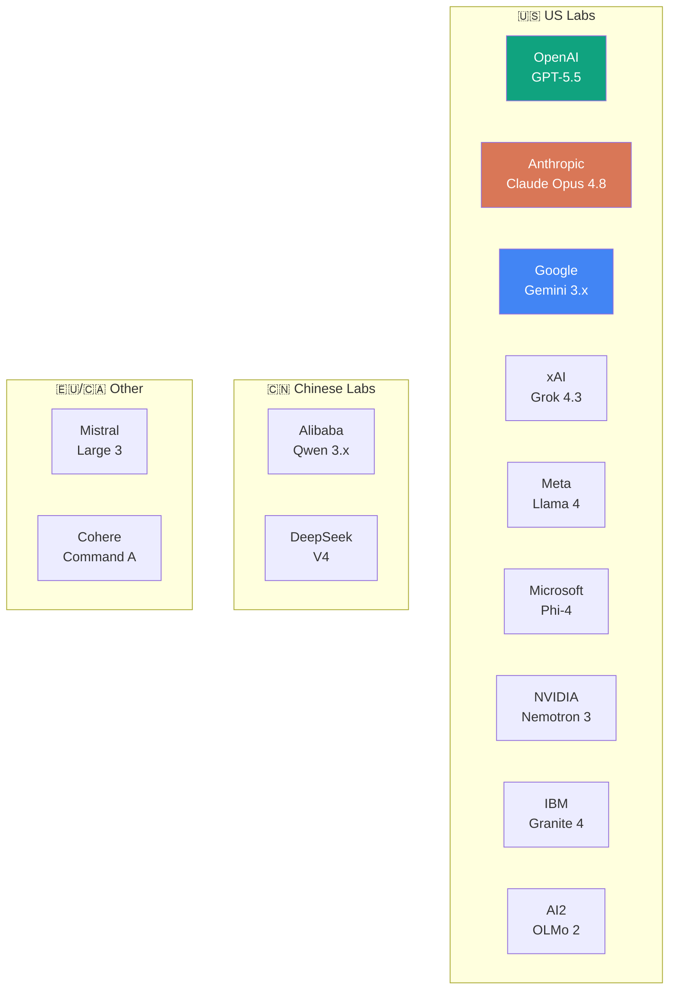

# 5. Provider Guides

> A concise, per-provider breakdown: who they are, their current lineup, what makes them distinctive, and licensing. **Snapshot: June 2026.**

[← Previous: Model Comparisons](04-model-comparisons.md) · [Next: Decision Guides →](06-decision-guides.md)

---

## Map of the major players

---

## 🟢 OpenAI

**Flagship:** GPT-5.5 (April 2026) · **Top tier:** GPT-5.5 Pro

- **Lineup:** GPT-5.5 & GPT-5.5 Pro (frontier) · GPT-5.4 + mini/nano (mainstream production) · GPT-4.1 (1M-context workhorse) · o3 / o4-mini (standalone reasoning).
- **Context:** ~1M (922K in / 128K out on GPT-5.5). Pricing steps up past ~272K input tokens.
- **Reasoning:** `reasoning effort` is dial-able — `none → low → medium → high → xhigh`.
- **Distinctive:** Broadest ecosystem and tooling; consistently top-tier coding-agent and math performance; cached input ~90% cheaper.
- **Pricing:** GPT-5.5 $5/$30; Pro $30/$180 (per 1M).
- **Access:** Proprietary API + ChatGPT; also on Azure.

## 🟠 Anthropic

**Flagship:** Claude Opus 4.8 · **Balanced:** Sonnet 4.6 · **Fast:** Haiku 4.5 · **Top tier:** Fable 5 (limited availability)

- **Tiers:** Opus (max capability), Sonnet (balanced), Haiku (fast/cheap) — plus a higher Fable/Mythos class introduced in 2026 with restricted availability.
- **Context:** 1M tokens (Haiku 200K); prompt caching up to ~90% savings.
- **Distinctive:** Long the favorite for **coding and agentic workflows**; strong, careful writing; powers Claude Code. Originated the **[MCP](02-terminology.md#mcp-model-context-protocol)** standard.
- **Pricing:** Opus 4.8 $5/$25 · Sonnet 4.6 $3/$15 · Haiku 4.5 $1/$5 (per 1M).
- **Access:** Proprietary API + Claude apps; AWS Bedrock, Google Cloud, Microsoft Foundry.

## 🔵 Google (DeepMind)

**Flagship:** Gemini 3.1 Pro (2M context) · **Fast:** Gemini 3.5 Flash · **Deep:** Gemini 3 Deep Think

- **Lineup:** Gemini 3.1 Pro (largest context, 2M) · 3.5 Flash (speed + agentic, beats 3.1 Pro on some coding/agent benchmarks at lower cost) · Deep Think (max reasoning) · Gemma (open lightweight family).
- **Distinctive:** Best-in-class **multimodal** (image, audio, **video**), industry-leading **context window**, deep Google product/Cloud integration.
- **Access:** Gemini API (AI Studio), Vertex AI, Gemini apps. Gemma models are open-weight.

## ⚫ xAI

**Flagship:** Grok 4.3 (1M) · **Multi-agent:** Grok 4.20 (2M) · **Upcoming:** Grok 5 (in training)

- **Distinctive:** Real-time access to **X (Twitter)** data; aggressive pricing; Grok 4.20 uses a native multi-agent architecture; reasoning + non-reasoning modes.
- **Pricing:** Grok 4.3 ~$1.25/$2.50 — strong value at the frontier.
- **Access:** xAI API and X platform.

## 🦙 Meta

**Family:** Llama 4 (first Meta MoE family) — Scout, Maverick, Behemoth (preview)

- **Scout:** 17B active / 16 experts, **10M** context, fits a single H100 — the long-context + local champion.
- **Maverick:** 17B active / 128 experts (~400B total), 1M context, strong multimodal general model.
- **Behemoth:** ~2T total / 288B active — in preview/training as a "teacher" model.
- **Distinctive:** The **most widely deployed open-weight ecosystem**; native multimodality.
- **License:** Llama Community License — free for most commercial use, but **with restrictions** (not OSI-open). Read it for your use case.

## 🐧 Alibaba (Qwen)

**Flagship:** Qwen 3.7 Max (May 2026) · **Open MoE:** Qwen3-235B-A22B, Qwen3-30B-A3B

- **Distinctive:** Among the strongest **open-weight** families; excellent **agentic coding & tool use**; many sizes (dense + MoE), vision (Qwen-VL), and "thinking" modes.
- **Context:** ~1M on flagship tiers.
- **License:** Many models **Apache 2.0** (very permissive) — a favorite for self-hosting.

## 🐳 DeepSeek

**Flagship:** DeepSeek V4 Pro & V4 Flash (April 2026)

- **Distinctive:** Tops several **open-weight** coding/math benchmarks (LiveCodeBench, Codeforces, HMMT, GPQA); within striking distance of closed frontier — at a *fraction* of the cost (reportedly ~30×+ cheaper per output token than GPT-5.5).
- **Context:** ~1M (up to 384K output). **License: MIT** (extremely permissive).
- **Why it matters:** The poster child for "open is catching up, cheaply."

## 🔷 Mistral AI

**Flagship:** Mistral Large 3 (Dec 2025) · **Merged:** Mistral Medium 3.5

- **Large 3:** Sparse MoE, ~41B active / 675B total, 256K context, multimodal, 40+ languages.
- **Distinctive:** Leading **European** lab; strong multilingual; open-weight options; data-sovereignty appeal for EU enterprises.

## 🟩 NVIDIA

**Family:** Nemotron 3 — Nano, Nano Omni, Super

- **Nano:** 30B total / 3.5B active, hybrid **Mamba-Transformer MoE**. **Nano Omni:** adds text/image/video/audio. **Super:** 120B total / 12B active for agentic throughput.
- **Distinctive:** **Truly open** — weights, *training data*, and recipes. Optimized for NVIDIA hardware and agentic efficiency; anchors the multi-lab **Nemotron Coalition**.

## 🟦 Microsoft

**Family:** Phi-4 — mini, multimodal, reasoning, reasoning-vision-15B

- **Distinctive:** The leading **small-but-mighty** models — strong reasoning at tiny sizes, **MIT licensed**, ideal for **local/edge**. Phi-4-reasoning-vision adds GUI grounding & document analysis.
- **Note:** Microsoft also ships frontier models via **Azure AI Foundry** (hosting OpenAI, Anthropic, Meta, Mistral, Qwen, etc.) — it's both a model maker *and* a platform.

## 🟫 IBM

**Family:** Granite 4 / 4.1 — 3B / 8B / 30B (+ FP8, vision, speech, safety)

- **Distinctive:** **Enterprise-first**, **Apache 2.0**, governance/transparency focus, efficient sizes for on-prem business workloads (RAG, extraction, document AI).

## 🟪 AI2 (Allen Institute for AI)

**Family:** OLMo 2 (7B / 13B)

- **Distinctive:** The standard-bearer for **fully open science** — open weights, **open data**, and open training recipes. Competitive with similarly sized open-weight models; invaluable for research and reproducibility.

## 🟧 Cohere

**Flagship:** Command A (111B dense) · Command A+ (open weights)

- **Distinctive:** **Enterprise & RAG** focus, strong retrieval/search and multilingual, 256K context, runs on as few as 2 GPUs.
- **License:** Command A weights are **CC-BY-NC (non-commercial)**; commercial use needs a Cohere license.

---

## Provider cheat sheet

| Provider | Pick them for | Openness |
| --- | --- | --- |
| OpenAI | All-round frontier, coding agents, ecosystem | Closed |
| Anthropic | Coding, agents, careful writing, MCP | Closed |
| Google | Multimodal, video, longest context | Closed (+ open Gemma) |
| xAI | Real-time/X data, value pricing | Closed |
| Meta | Widely-supported open-weight, long context | Open-weight (restricted license) |
| Alibaba (Qwen) | Open agentic coding, many sizes | Open (Apache 2.0) |
| DeepSeek | Cheap open frontier coding/math | Open (MIT) |
| Mistral | European, multilingual, sovereignty | Open-weight |
| NVIDIA | Truly-open, hardware-optimized agents | Fully open |
| Microsoft | Small/local + Azure platform | Open (MIT) + platform |
| IBM | Enterprise on-prem, governance | Open (Apache 2.0) |
| AI2 | Open science, reproducibility | Fully open |
| Cohere | Enterprise RAG/search | Non-commercial weights |

---

[← Previous: Model Comparisons](04-model-comparisons.md) · [Next: Decision Guides →](06-decision-guides.md)
