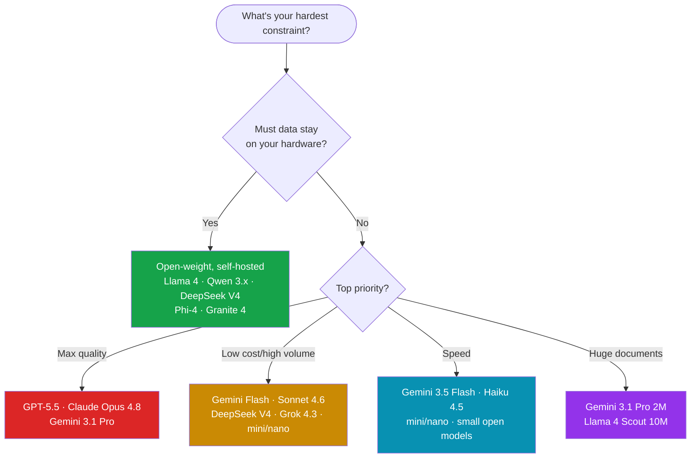
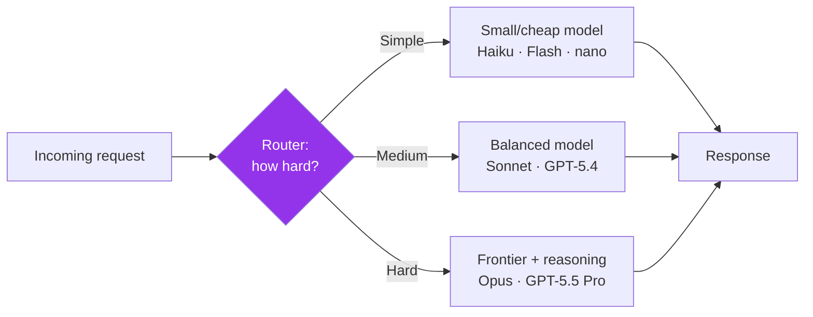

# 6. Decision Guides

> "Just tell me which model to use." This page does exactly that — by task, by constraint, with the reasoning behind each pick. **Snapshot: June 2026.**

[← Previous: Provider Guides](05-provider-guides.md) · [Next: Timeline →](07-timeline.md)

> 🧭 **Golden rule:** Start with your *hardest constraint* (privacy, budget, latency, or quality), then pick the best model that satisfies it. Validate on **your own** tasks — public benchmarks are a starting point, not a verdict.

---

## 6.1 The master decision tree

---

## 6.2 Best model by use case

### 💻 Coding & software engineering
| Pick | Why |
| --- | --- |
| 🥇 **Claude Opus 4.8 / GPT-5.5** | Top SWE-bench & agentic coding; best in IDE/agent harnesses |
| 🥈 **Gemini 3.5 Flash** | Excellent coding/agentic scores at much lower cost & latency |
| 🔓 **DeepSeek V4 Pro / Qwen 3.7 Max** | Best open-weight coders; near-frontier at a fraction of cost |
| 💻 Local: **Qwen3-30B-A3B / Llama 4** | Private, offline coding assistants |

> 💡 For agentic coding, the *harness* (tooling, context management) often matters as much as the model. Test in your actual setup.

### 🧠 Complex reasoning, math & science
| Pick | Why |
| --- | --- |
| 🥇 **GPT-5.5 Pro / o-series** | Top math (AIME) and hard-reasoning performance |
| 🥇 **Claude Opus 4.8 (extended thinking)** | Strong, reliable multi-step reasoning |
| 🥈 **Gemini 3 Deep Think** | Maximum-effort reasoning mode |
| 🔓 **DeepSeek V4 Pro** | Best open reasoning/math; GPQA & HMMT leader among open weights |

> Use **reasoning mode / high effort** — and budget for extra "thinking" tokens.

### 👁️ Vision & multimodal
| Pick | Why |
| --- | --- |
| 🥇 **Gemini 3.1 Pro / 3.5 Flash** | Best all-round multimodal incl. **video** + audio |
| 🥈 **GPT-5.5 / Claude Opus 4.8** | Strong image understanding, charts, screenshots |
| 🔓 **Qwen-VL / Llama 4** | Best open multimodal |
| 💻 Local: **Phi-4-multimodal / Nemotron Nano Omni** | Small multimodal on-device |

### 📜 Long-context tasks (whole codebases, archives, books)
| Pick | Why |
| --- | --- |
| 🥇 **Llama 4 Scout** | **10M** tokens — and self-hostable on one H100 |
| 🥈 **Gemini 3.1 Pro** | **2M** tokens, strong recall, multimodal |
| 🥉 **GPT-5.5 / Claude / DeepSeek V4** | 1M, frontier quality |

> ⚠️ Don't just dump everything in. Combine long context with [RAG](09-concepts-deep-dive.md#rag-retrieval-augmented-generation) to control cost and improve recall.

### 💻 Local / on-device deployment
| Pick | Why |
| --- | --- |
| 🥇 **Phi-4 family** | Best capability-per-parameter; MIT; runs on a laptop |
| 🥈 **Qwen3-30B-A3B / Nemotron Nano** | Efficient MoE; strong quality on a single GPU |
| 🥉 **Granite 4 (3B/8B)** | Enterprise-friendly, Apache 2.0 |
| 📦 **Llama 4 Scout** | When you need huge context locally |

> Use [quantization](02-terminology.md#quantization) (4-bit/8-bit) + Ollama / LM Studio / llama.cpp / vLLM.

### 🏢 Enterprise & regulated industries
| Pick | Why |
| --- | --- |
| 🥇 **Claude (Opus/Sonnet) / GPT-5.5** via private cloud | Frontier quality + enterprise controls (zero-retention, VPC) |
| 🥈 **Granite 4 (IBM)** | Built for enterprise governance & on-prem |
| 🥉 **Mistral Large 3** | EU data sovereignty, multilingual |
| 🔎 **Cohere Command A** | Enterprise RAG/search (commercial license) |

> Decisions here hinge on **compliance, data residency, SLAs, and indemnification** — not just benchmarks. Major clouds (Azure AI Foundry, AWS Bedrock, Google Vertex) host many of these with enterprise terms.

### 💰 Cost efficiency / high volume
| Pick | Why |
| --- | --- |
| 🥇 **Self-hosted open weights (DeepSeek V4, Qwen, Llama 4)** | Lowest marginal cost at scale |
| 🥈 **Grok 4.3 / Gemini Flash / mini-nano** | Cheapest hosted frontier-ish options |
| 🥉 **Claude Sonnet 4.6** | Great quality-per-dollar for production |

> 💡 **Cut cost without switching models:** prompt caching (~90% off), batch APIs (~50% off), route easy turns to a smaller model, and lower reasoning effort.

---

## 6.3 Model routing: use more than one

Mature systems rarely use a single model. A common pattern:

**Why route:** most requests are easy. Sending everything to a frontier model wastes money and time. Route by difficulty (classifier, heuristics, or a small "judge" model) and reserve premium models for hard turns.

---

## 6.4 A pragmatic selection checklist

- [ ] **Privacy:** Must data stay on-prem? → open-weight/local.
- [ ] **Budget:** What's your cost ceiling per request *and* per month at scale?
- [ ] **Latency:** Is this interactive (needs speed) or batch (can be slow)?
- [ ] **Task difficulty:** Does it actually need reasoning, or is a small model fine?
- [ ] **Modality:** Text only, or images/audio/video?
- [ ] **Context size:** How much must the model see at once?
- [ ] **Ecosystem:** SDKs, tool-calling, MCP support, cloud availability?
- [ ] **Licensing:** Commercial use allowed? (Check Llama, Cohere, Gemma terms.)
- [ ] **Evaluate:** Did you test the top 2–3 candidates on *your* data? ✅ Always do this.

---

[← Previous: Provider Guides](05-provider-guides.md) · [Next: Timeline →](07-timeline.md)
