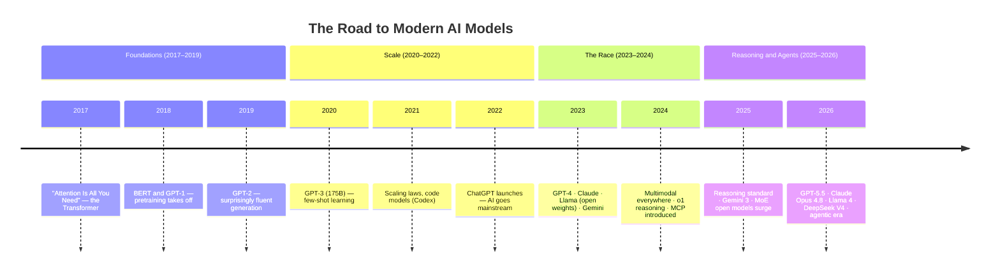
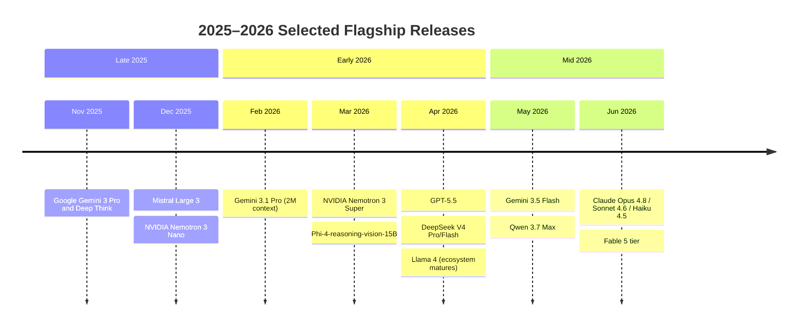

# 7. Timeline

> How we got from "autocomplete" to autonomous agents. A visual history of the milestones that shaped today's frontier. **Snapshot: June 2026.**

[← Previous: Decision Guides](06-decision-guides.md) · [Next: Benchmarks Explained →](08-benchmarks.md)

---

## 7.1 The eras at a glance

---

## 7.2 Why each era mattered

| Era | Breakthrough | What it unlocked |
| --- | --- | --- |
| **Transformer (2017)** | The attention mechanism | A scalable architecture — the basis of *every* model here |
| **Pretraining (2018–2019)** | Learn from raw text, then adapt | General-purpose [foundation models](02-terminology.md#foundation-model) |
| **Scale (2020–2022)** | Bigger = qualitatively better | Emergent abilities; few-shot prompting |
| **ChatGPT (2022)** | Usable chat interface + RLHF | Mass adoption; the product era begins |
| **The race (2023–2024)** | Many strong models; open weights | Competition, choice, and the open/closed split |
| **Multimodal (2024)** | Native image/audio/video | Vision, voice, documents, "computer use" |
| **Reasoning (2024–2025)** | Think before answering | Leap on math/coding/science; test-time compute |
| **Agents (2025–2026)** | Plan → act → observe loops + MCP | Autonomous coding, research, and task completion |

---

## 7.3 2025–2026 flagship release cadence (selected)

> Approximate public release timing. The pace is roughly a major model every few weeks across the industry.

---

## 7.4 Where the trend lines point

Reading the trajectory (with appropriate humility — predictions age badly):

- **Reasoning becomes free-ish and ambient.** Dial-able "thinking" is standard; the question shifts from *whether* to reason to *how much*.
- **Open weights keep closing the gap.** DeepSeek/Qwen-class models already match closed frontier on many tasks at a fraction of the cost — expect this to continue.
- **Agents mature from demos to dependable workers.** Reliability over long horizons, memory, and tool ecosystems (MCP) are the battleground.
- **Context and multimodality stop being differentiators.** 1M+ context and native multimodality become table stakes; *quality of use* matters more than raw size.
- **Efficiency is the real frontier.** MoE, hybrid (Mamba) architectures, quantization, and distillation push capability *down* into cheap, local, and edge deployments.
- **Geopolitics enters the picture.** Export controls and data-sovereignty rules increasingly affect *which* models are available *where* — a non-technical factor that now shapes architecture choices.

> 📌 The constant: **there is no finish line.** Build systems that can swap models, and re-evaluate every few months.

---

[← Previous: Decision Guides](06-decision-guides.md) · [Next: Benchmarks Explained →](08-benchmarks.md)
