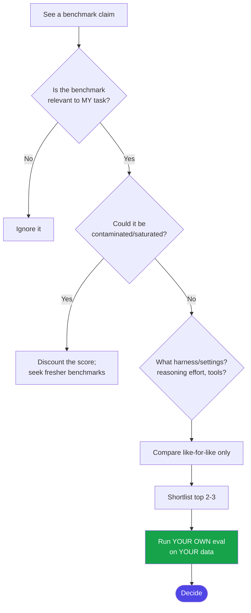

# 8. Benchmarks Explained

> What the scores actually measure, which ones matter in 2026, and how to read them without getting fooled. **Snapshot: June 2026.**

[← Previous: Timeline](07-timeline.md) · [Next: Concepts Deep Dive →](09-concepts-deep-dive.md)

---

## 8.1 Why benchmarks exist (and why to be skeptical)

Benchmarks are standardized tests that let us compare models on the same tasks. They're useful for **rough ranking** — but they are **not** a substitute for testing on *your* workload.

> ⚠️ **The four big caveats:**
> 1. **Contamination** — test questions may have leaked into training data, inflating scores. (Labs now flag this on SWE-bench Verified; *SWE-bench Pro* is emerging as a cleaner successor.)
> 2. **Saturation** — once everyone scores ~95%, the benchmark stops distinguishing models.
> 3. **Gaming** — vendors optimize for the tests everyone cites.
> 4. **Mismatch** — a model that tops MMLU may still be wrong for *your* task.

**Bottom line:** Use benchmarks to build a shortlist; use **your own evals** to choose.

---

## 8.2 The benchmarks that matter in 2026

| Benchmark | Measures | Why it matters now |
| --- | --- | --- |
| **SWE-bench Verified / Pro** | Real GitHub issue fixes | The headline test for **agentic coding**; Pro is the cleaner version |
| **Terminal-Bench** | Multi-step terminal/agent tasks | Tests real **agentic** tool use, not just code snippets |
| **LiveCodeBench** | Fresh competitive-programming problems | Contamination-resistant **coding** signal |
| **GPQA Diamond** | Graduate-level science Q&A | The most discriminating **reasoning** test at the frontier |
| **Humanity's Last Exam (HLE)** | Extremely hard expert questions | Frontier **general intelligence** ceiling |
| **AIME / HMMT** | Olympiad-level math | Pure **math reasoning** |
| **MMLU / MMLU-Pro** | Broad multi-subject knowledge | Classic general-knowledge baseline (now near-saturated) |
| **MMMU** | Multimodal (image + text) reasoning | The key **vision/multimodal** benchmark |
| **Chatbot Arena (Elo)** | Human preference, head-to-head | Real-world "which answer do people prefer" |
| **MCP Atlas** | Tool/agent interoperability | Tests **tool-calling** in agentic settings |

---

## 8.3 What "good" looks like (directional, June 2026)

> These move constantly and differ by source/harness. Treat as *ballpark*, not authoritative — verify on live leaderboards.

| Domain | Benchmark | Frontier range | Notable leaders |
| --- | --- | --- | --- |
| Agentic coding | SWE-bench Verified | ~75–80%+ | GPT-5.5, Claude Opus, Gemini Flash |
| Science reasoning | GPQA Diamond | ~90–95% | GPT-5.5, Claude (Mythos/Opus class), DeepSeek V4 |
| Math | AIME 2026 | up to ~100% | GPT-5 class, top reasoning models |
| Open-weight coding | LiveCodeBench | ~90%+ | **DeepSeek V4 Pro** (open leader) |
| Agentic tasks | Terminal-Bench 2.x | ~70–76% | Gemini 3.5 Flash, Qwen 3.7 Max |

> 💡 The headline story of 2026: **top open-weight models (DeepSeek V4, Qwen 3.x) now appear in the same range as closed frontier models** on coding and math — at dramatically lower cost.

---

## 8.4 How to read a leaderboard critically

---

## 8.5 Build your own evaluation (the part that actually matters)

A lightweight eval beats any public leaderboard for *your* decision:

1. **Collect 20–50 real examples** from your actual use case (with ideal answers where possible).
2. **Define success** — exact match? rubric score? human thumbs-up? latency/cost budget?
3. **Run the top 2–3 candidate models** with identical prompts and settings.
4. **Score** automatically (string/JSON checks) and/or with an **LLM-as-judge** plus spot human review.
5. **Compare quality, cost, and latency together** — the cheapest model that passes wins.
6. **Re-run quarterly** — models and prices change constantly.

> 📌 A model that's "2% better" on a public benchmark but 5× more expensive and 3× slower is usually the *wrong* choice for production.

---

[← Previous: Timeline](07-timeline.md) · [Next: Concepts Deep Dive →](09-concepts-deep-dive.md)
