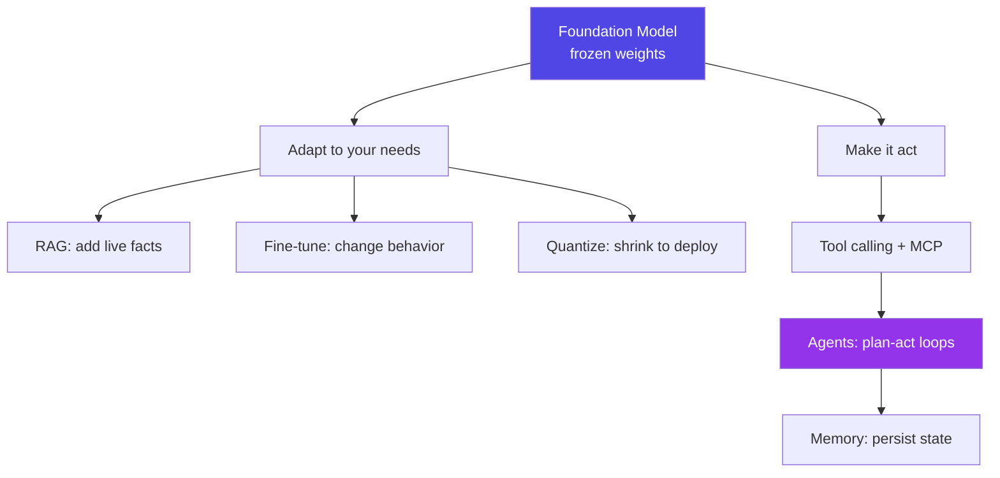
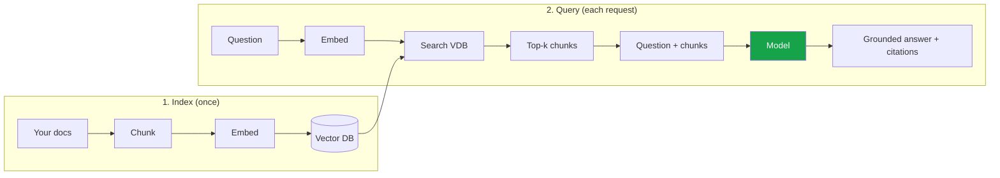
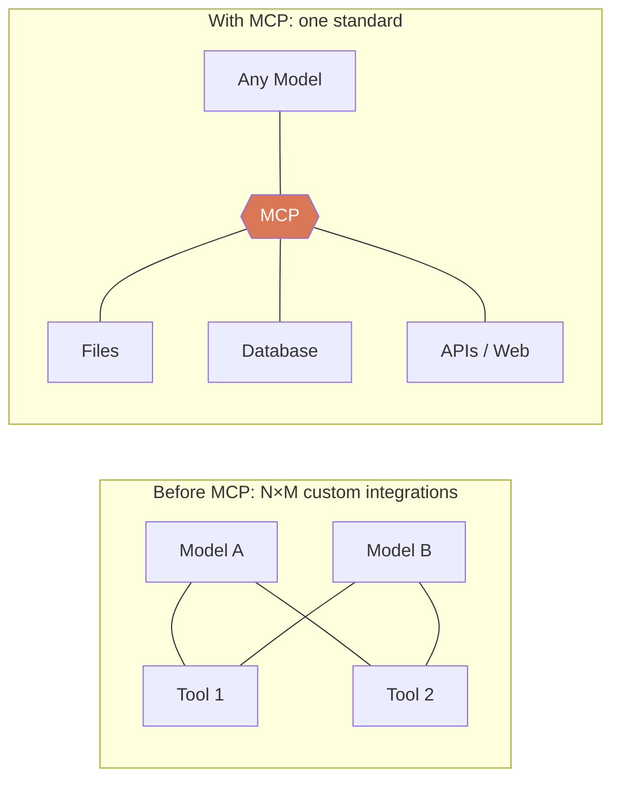
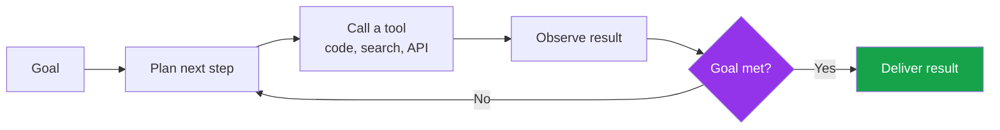
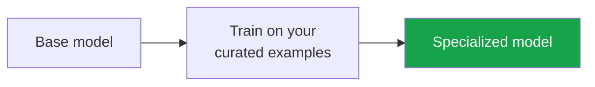
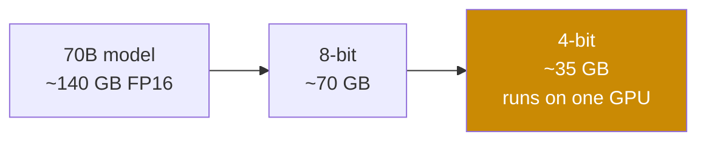
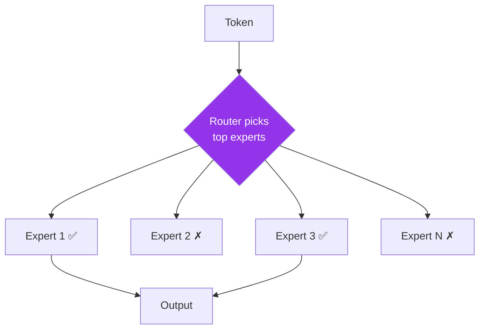
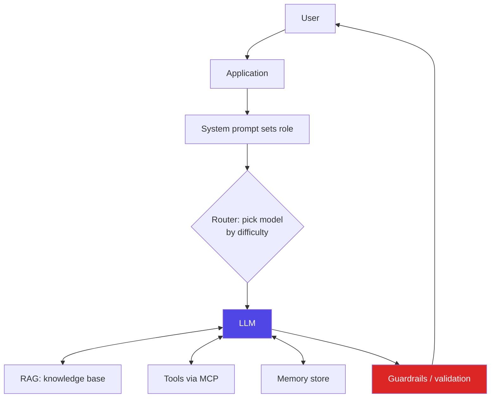

# 9. Concepts Deep Dive

> A little more depth on the techniques that turn a raw model into a useful product: RAG, MCP, agents, memory, fine-tuning, quantization, and Mixture-of-Experts. Still beginner-friendly — practical over theoretical.

[← Previous: Benchmarks](08-benchmarks.md) · [Next: References →](10-references.md)

---

## How these fit together

---

## RAG (Retrieval-Augmented Generation)

**The problem it solves:** Models have a frozen [knowledge cutoff](02-terminology.md#training) and don't know your private data. RAG feeds relevant, current facts into the prompt *at query time*.

**How it works:**

**When to use RAG vs. alternatives:**
| Need | Best approach |
| --- | --- |
| Add current/private **facts** | ✅ RAG |
| Change **behavior/format/tone** | Fine-tuning or system prompt |
| Cite sources / reduce hallucination | ✅ RAG |
| Task fits entirely in context | Just use a long context window (or combine with RAG) |

> 💡 **2026 reality:** With 1M+ context windows, "just put it in the prompt" is viable for small corpora. RAG still wins for **large, changing knowledge bases**, **cost control**, and **citations**.

---

## MCP (Model Context Protocol)

**The problem it solves:** Every model-to-tool connection used to be a custom integration. MCP is an **open standard** (introduced by Anthropic, late 2024; now widely adopted) that lets *any* compatible model talk to *any* compatible tool or data source.

**Why it matters:** MCP is the connective tissue of the agent era — file systems, databases, browsers, internal APIs, and SaaS tools all expose **MCP servers** that any MCP-capable client (Claude, IDEs, agent frameworks) can use. Think **"USB-C for AI tools."**

---

## Agents

**Definition:** A system where the model runs a loop — **plan → act (call tools) → observe → repeat** — to accomplish a goal autonomously.

**Building blocks:** [tool calling](02-terminology.md#tool-calling) + [MCP](#mcp-model-context-protocol) + [memory](#memory) + [reasoning](02-terminology.md#reasoning).

**The hard part — reliability:** Small per-step error rates compound over long tasks. Good agents add: scoped tools, verification/critic steps, retries, guardrails, human-in-the-loop checkpoints, and clear stopping conditions.

**Common patterns:** coding agents (Claude Code, IDE assistants), research agents, "computer use" (clicking through GUIs), and multi-agent systems (specialized agents collaborating, e.g., Grok 4.20's architecture).

---

## Memory

Because the [context window](02-terminology.md#context-window) is wiped between sessions, "memory" is built *around* the model:

| Type | What it does | How it's built |
| --- | --- | --- |
| **Short-term** | Current conversation | Held in the context window |
| **Long-term / persistent** | Recall facts across sessions | Stored externally (DB/vector store), retrieved like RAG |
| **Episodic** | Remember past interactions/tasks | Logs + summaries fed back in |
| **Working/scratchpad** | Track state mid-task | Notes the agent writes & re-reads |

> 💡 Memory is usually **retrieval + summarization**, not changing the model's weights.

---

## Fine-tuning

**Definition:** Further-training a base model on a smaller, specialized dataset to change its **behavior, style, or domain skill**.

| Method | Cost | Use |
| --- | --- | --- |
| **Full fine-tuning** | High | Deep specialization; rarely needed |
| **LoRA / PEFT** | Low | Adjust small adapter layers — cheap & popular |
| **Instruction / preference tuning** | (vendor) | What turns a base model into a helpful "chat" model |

**Fine-tune vs. RAG vs. prompting:**
| Goal | Use |
| --- | --- |
| Add facts | RAG |
| Enforce a consistent format/persona/style | Fine-tuning |
| Quick behavior tweak | System prompt / prompt engineering |
| Domain jargon & patterns at scale | Fine-tuning (+ RAG for facts) |

> 📌 Try **prompting → RAG → fine-tuning**, in that order. Most needs are met before you reach fine-tuning.

---

## Quantization

**Definition:** Storing weights at lower numerical precision to shrink the model and speed up [inference](02-terminology.md#inference), with usually small quality loss.

| Precision | Relative size | Typical use |
| --- | --- | --- |
| FP16 / BF16 (16-bit) | 100% | Full quality, cloud serving |
| FP8 / INT8 (8-bit) | ~50% | Great quality/size balance (e.g., Granite FP8) |
| INT4 (4-bit) | ~25% | Local/laptop; minor quality dip |

> 💡 Quantization is the key that makes **local deployment** practical. Tools: Ollama, LM Studio, llama.cpp, vLLM, GGUF/AWQ/GPTQ formats.

---

## Mixture-of-Experts (MoE)

**Definition:** Instead of one big dense network, an MoE model has many "expert" sub-networks and a **router** that activates only a few per token.

**Why it matters:** You get the **knowledge of a huge model** with the **compute cost of a small one**. That's why specs cite *active vs. total* parameters — e.g., **Llama 4 Maverick: 17B active / ~400B total**; **Mistral Large 3: 41B active / 675B total**; **Qwen3-30B-A3B: 3B active / 30B total**. MoE underpins most efficient 2026 open models, often blended with **hybrid Mamba-Transformer** designs (NVIDIA Nemotron) for cheaper long context.

---

## Putting it all together: a typical 2026 AI application

Almost no production system is "just a model." The model is the engine; **RAG, MCP/tools, memory, routing, and guardrails** are the car around it.

---

[← Previous: Benchmarks](08-benchmarks.md) · [Next: References →](10-references.md)
